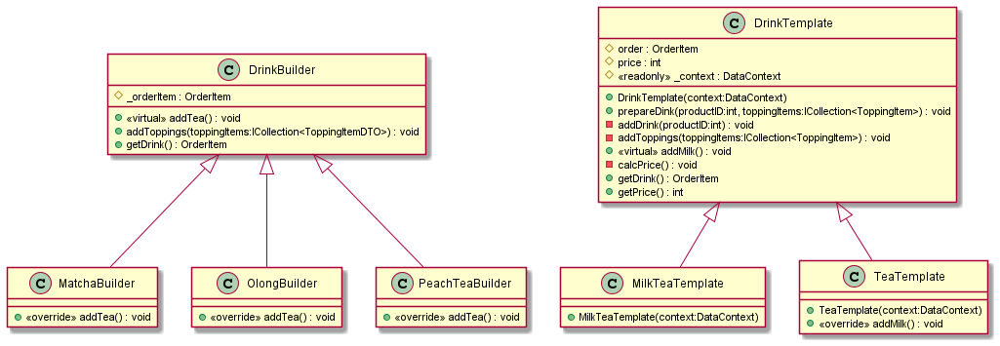
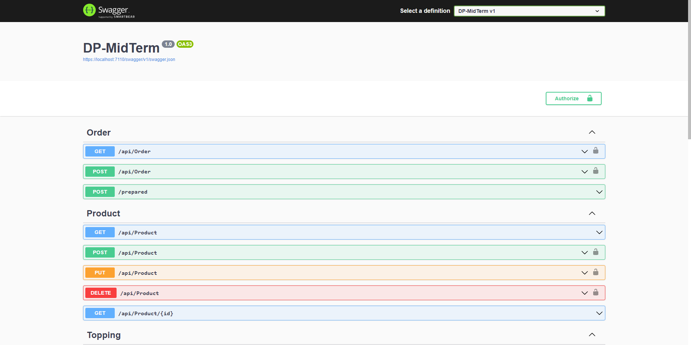
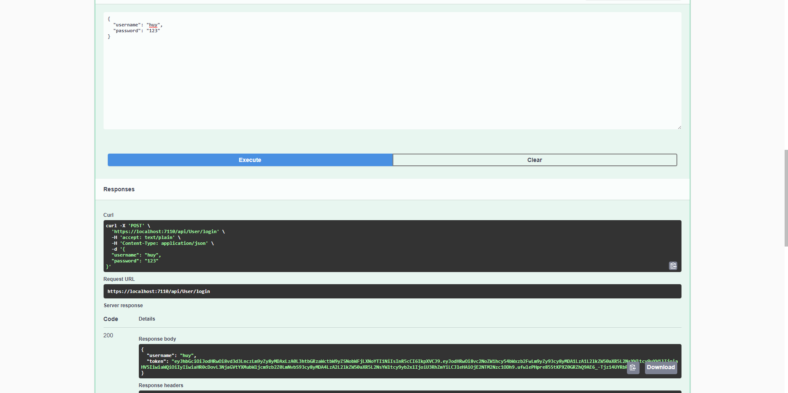
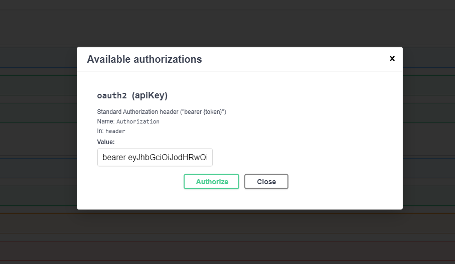
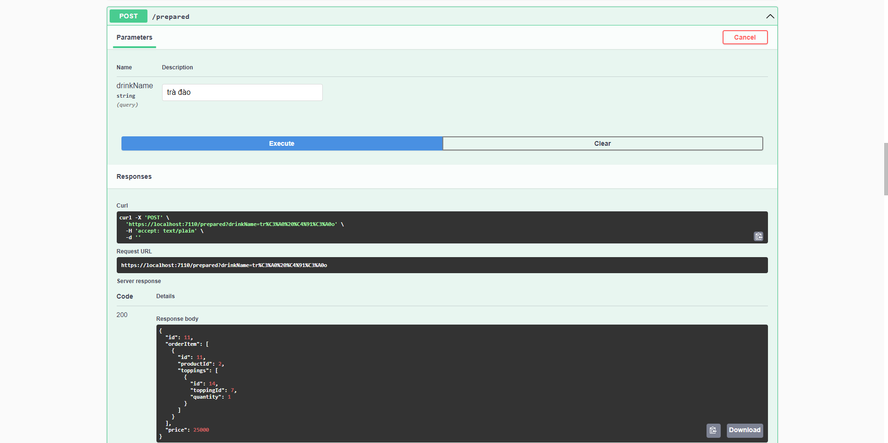
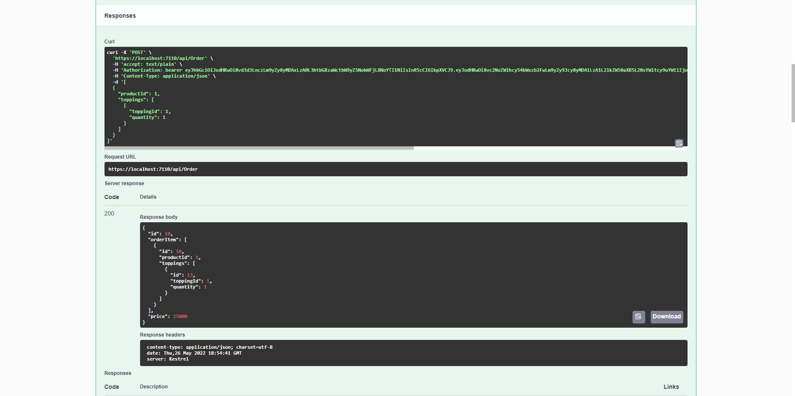

# Drink & Chill server API

## Giới thiệu

Project này là một web server API, cho phép người dùng đặt món và thêm topping vói các option khác nhau, khách hàng có thể lựa chọn giữa việc tự pha chế cho mình một ly nước hoặc gọi một ly theo công thức có sẵn (áp dụng template pattern). Một số chức năng chính:

- Đăng nhập
- Đăng ký
- Xác thực quyền người dùng
- Thêm xóa sửa data
- Đặt hàng online
- Lưu trữ dữ liệu vào Database bằng entity framework

## Yêu cầu

- ASP.Net 6
- MSSQL

## Cách khởi chạy

1. Clone project
2. Mở terminal và đến thư mục DP-Midterm (Nơi chứa các folder như Controllers, Data, Functions, Models,...)
3. Chạy các lệnh sau 

    ```bash
    dotnet ef database update
    dotnet watch
    ```

4. Import data từ folder DB vào database trong hệ thống

## Kiến thức về pattern

Project này áp dụng các design pattern sau:

- Factory method
- Template method

### Builder method

- Trong công nghệ phần mềm, một mẫu thiết kế design pattern là một giải pháp tổng thể cho các vấn đề chung trong thiết kế phần mềm, giúp thiết kế của chúng ta linh hoạt, dễ dàng thay đổi và bảo trì hơn.
- Hơn nữa, Builder pattern được tạo ra để xây dựng một đôi tượng phức tạp bằng cách sử dụng các đối tượng đơn giản và sử dụng tiếp cận từng bước, việc xây dựng các đối tượng đôc lập với các đối tượng khác
- Trong project này, ta sử dụng builder method để tạo ra sản phẩm là một ly nước dựa trên các thuộc tính đầu vào là một danh sách món hàng bao gồm loại nước (trà olong, trà đào, trà matcha) và danh sách topping (loại topping, số lượng), đầu ra là một hóa đơn bao gồm danh sách các món nước cùng tổng tiền.

### Template method templates

- Template Method Pattern là một trong những Pattern thuộc nhóm hành vi (Behavior Pattern). Pattern này nói rằng “Định nghĩa một bộ khung của một thuật toán trong một chức năng, chuyển giao việc thực hiện nó cho các lớp con. Mẫu Template Method cho phép lớp con định nghĩa lại cách thực hiện của một thuật toán, mà không phải thay đổi cấu trúc thuật toán“.
- Điều này có nghĩa là Template method giúp cho chúng ta tạo nên một bộ khung (template) cho một vấn đề đang cần giải quyết. Trong đó các đối tượng cụ thể sẽ có cùng các bước thực hiện, nhưng trong mỗi bước thực hiện đó có thể khác nhau. Điều này sẽ tạo nên một cách thức truy cập giống nhau nhưng có hành động và kết quả khác nhau.
- Trong project này, ta sử dụng template method để tạo ra sản phẩm là một ly nước theo công thức cho trước, với đầu vào là tên món nước đó, được khởi tạo từ data có sẵn trong db.

## Chi tiết thông tin ứng dụng

Diagram pattern



## Kết quả triển khai thực tế

Main Swagger



Login



Add bearer token



Make drink in menu by template method



Make order by builder method



## Thông tin người phát triển

Nguyễn Thanh Huy - 51800781
